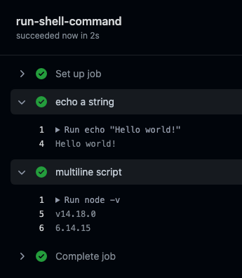
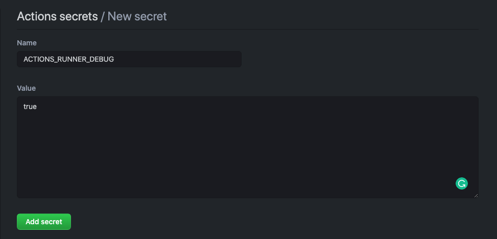
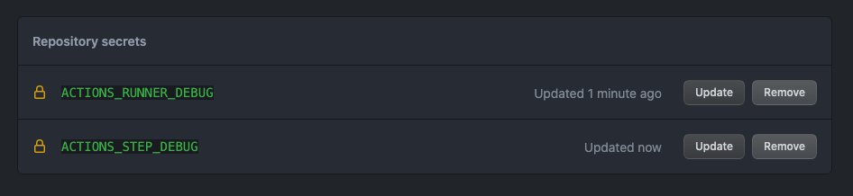

# Introduction

GitHub Actions is a tool that allows you to automate development workflows. Each task is called an **action**. A combination of tasks is called a **workflow**. Workflows can be triggered in different ways: push, pull requests (opened and/or merged), issues (created, closed, etc), on a specific schedule, or due to external events.

The workflows will be run in a virtual machine on the GitHub servers. A workflow can contain one or more **jobs**, and each job will run in its own virtual machine. These virtual machines can use Linux, Windows, MacOS with different tools installed, and even run Docker Containers. Jobs can be run in parallel, or we can specify dependencies between them.

A **runner** is any virtual machine with the GitHub actions application installed. The runner is responsible for running the job whenever the triggering conditions are met, and for displaying back the results. You can use GitHub's runners, or host your own ones. GitHub hosted runners are maintained by GitHub, but we cannot customize the hardware configurations. They also come with some pre-installed tools like `curl`, `git`, `npm`, `yarn`, `pip`, etc, and languages like Python, Ruby, node.JS, etc.

## YAML

GitHub actions need to be written in YAML. This is a data serialization language. Just like JSON, YAML uses key:value paris. Keys must be followed by a colon, `:`. Values can be in different data types (strings, numbers, booleans, arrays, etc). Strings in YAML do not need quotations around them, unless there's a reserve character in the string, like a colon `:`.

``` yaml
name: Peter
age: 123
address: "Peter's street 235 apartment 1:23"
active: true
```

To create objects inside of objects in YAML we just need to indent the child object keys with 2 or 4 spaces with respect to its parent object. Keep in mind that, in YAML, tab indentations are not allowed, only spaces can be used. We can nest as many levels of objects as needed. We can also add JSON objects (with `{}`) as the value to a key. The keys in the objects don't need to be surrounded by quotes either.

``` yaml
key1: Peter
age: 123
address: "Peter's street 235 apartment 1:23"
active: true
food:
  favorite: pizza
  less-favorite: veggies
  other: { monday: soup, tuesday: ice cream, sundays: bread }
```

To declare arrays we start with the key in one line. In the subsequent lines we'll include the array elements. Each element must start with a dash, `-`, indented with 2 (or 4) spaces relative to the array key. Members of the array can be other objects too. Arrays can also be declared in JSON format (using `[]`).

``` yaml
friends:
  - Fiona
  - Roberta
  - Joe:
      like: false
```

Elements in the array can be objects. But these objects can have multiple key:value pairs. To declare them we just indent sub-sequent key:value pairs at the same level of indentation as the first element (the one preceded by the dash, `-`).

``` yaml
cake:
  - ingredients:
      - floor: "3 cups"
        water: "0.5 liters"
        salt: "just a pinch"
  - cook:
      - appliance: oven
        time: 145 hours
        temperature: 1000000 degrees
      - appliance: microwave oven
        time: 3 minutes
        temperature: who cares!
```

If we need to enter a long text that we want to break into multiple lines in the YAML file (for better readability), but in reality it should all be a single line, we can start the line with a single greater-than sign, `>`.

``` yaml
longText: >
  Lorem, ipsum dolor sit amet consectetur adipisicing elit. Eligendi, vitae!
  Aspernatur esse ex eaque obcaecati fuga aperiam voluptatem nobis similique
  earum, pariatur praesentium? Voluptatibus ex recusandae facilis. Eos, veniam
  unde.
```

If we do want to preserve the new lines, then we add a pipe, `|`, instead of a greater-than sign.

``` yaml
longText: |
  Lorem, ipsum dolor sit amet consectetur adipisicing elit. Eligendi, vitae!
  Aspernatur esse ex eaque obcaecati fuga aperiam voluptatem nobis similique
  earum, pariatur praesentium? Voluptatibus ex recusandae facilis. Eos, veniam
  unde.
```

## First workflow

All workflows must be placed inside the directory `.github/workflows` in the root directory. The first key of any workflow is `name`. The value that we pass will become the name of the workflow (GitHub will display this name in the Actions tab).

The second key is `on`. Its value can be a single element or an array. They define the list of events on which the workflow will trigger. These values can be: `workflow_dispatch`, `push`, `pull_request`, etc.

``` yaml
name: Shell commands
on: workflow_dispatch
```

The next key is `jobs`. Under this we can introduce an array of objects, each element of which will represent an task in that job. Each entry needs to be indented with respect of the `jobs` key. The key for each object in the `jobs` array is the name of the job. These can not have any spaces.

The first key of every job is `runs-on`. The value of this key needs to be the operating system in which the job is going to run. We can specify a version of the OS, or just use the key `<os>-latest` to have GitHub use the latest version of the OS.

Next comes the `steps` key, where we can specify the different steps of the job. We can specify a name for each step using the `name` key. After that we use the `run` key to specify what needs to be run on this step.

``` yaml
jobs:
  run-shell-command:
    runs-on: ubuntu-latest
    steps:
      - name: echo a string
        run: echo "Hello world!"
      - name: multiline script
        run: |
          node -v
          npm -v
```

We can now go to the Actions tab on the GitHub repo, and see the workflow.



The first and last step are automatically created by GitHub. The first one sets up the job, and the second one cleans up after finishing. You can configure GitHub to send notifications after each workflow run by going to *Profile > Settings > Notifications > Actions*.

We can cancel a workflow while it's still running by pressing the *Cancel check suite* button on the top right corner of the Actions tab. We can also explore the steps, including their output, but pressing the arrows left of the step name. We can also use the search bar to explore the logs. If the job failed, we can trigger a re-run.

For each job we can define **artifacts**. In a nut shell, an artifact is a file generated by the job. An artifact that gets generated by default is the *log archive*. We can download this file from the Actions console. The log consists of one `.txt` file for each step of the job. It is useful for debugging.

To see more information on the logs, we need to set the `ACTIONS_RUNNER_DEBUG` secret to `true`. To do so, we need to navigate to the *Settings* tab on the repo, and to the *Secrets* option on the left side menu, and click on the *New repository secret* button on the top right corner.



Then add the `ACTIONS_STEP_DEBUG` secret and set it to `true` as well. You can see all the secrets in the *Secrets* view.


