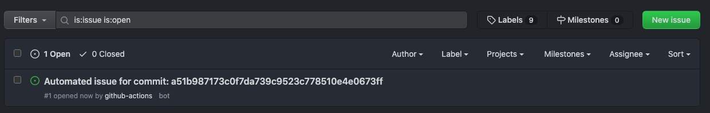
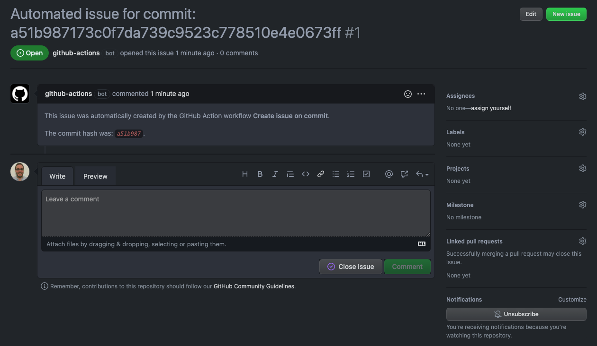

# Environment variables

## Default and custom environment variables

GitHub Actions already come with some built in environment variables. You can read about them [here](https://docs.github.com/en/actions/learn-github-actions/environment-variables). But we can define our own as well. To declare our own variables we need to use the `env` key at the start of our workflow. This key takes as its value a list of key:value pairs, where the keys are the names of the environment variables that we are declaring, and its value is the value of the variable.

``` yaml
name: Environment Variables (workflow scope)
on: push
env:
  WF_ENV: Available to all jobs
```

After that we can just write our `jobs` as we would normally do. To access the variables we just need to use the `${ VAR_NAME }` syntax.

``` yaml
name: Environment Variables (workflow scope)
on: push
env:
  WF_ENV: Available to all jobs
jobs:
  log-env:
    runs-on: ubuntu-latest
    steps:
      - name: Log ENV variables
        run: |
          echo "WF_ENV: ${WF_ENV}"
```

By default, environment variables are available to all jobs. But we can declare variables that are only available to certain jobs in our workflow. To do that, we need to include the `env` key in the specific job

``` yaml
name: Environment Variables (job scope)
on: workflow_dispatch
env:
  WF_ENV: Available to all jobs
jobs:
  log-env:
    runs-on: ubuntu-latest
    env:
      JOB_ENV: Available to steps in our log-env job
    steps:
      - name: Log ENV variables
        run: |
          echo "WF_ENV: ${WF_ENV}"
          echo "JOB_ENV: ${JOB_ENV}"
```

We can even declare environment variable that are only accessible to one step. Again, to do so, we add the `env` key in the specific `step` for which we want the variables to be available, and create a list of them using key:value pairs.

``` yaml
name: Environment Variables (step scoped)
on: workflow_dispatch
env:
  WF_ENV: Available to all jobs
jobs:
  log-env:
    runs-on: ubuntu-latest
    env:
      JOB_ENV: Available to steps in our log-env job
    steps:
      - name: Log ENV variables
        env:
          STEP_ENV: Available to only this step
        run: |
          echo "WF_ENV: ${WF_ENV}"
          echo "WF_ENV: ${JOB_ENV}"
          echo "WF_ENV: ${STEP_ENV}"
```

## Encrypting environment variables

Some variables need to be encrypted. To do so, we just need to add the variable value in *Settings > Secrets > Actions > New repository secret*. Give it a name and a value, and save it. These variables will be available in a workflow using an object called `secrets`

``` yaml
name: Environment Variables (secrets)
on: workflow_dispatch
env:
  SECRET_ENV_VARIABLE: ${{ secrets.SECRET_ENV_VARIABLE }}
jobs:
  log-env:
    runs-on: ubuntu-latest
    steps:
      - name: Log ENV variables
        run: |
          echo "SECRET_ENV_VARIABLE: ${SECRET_ENV_VARIABLE}"
```

One secret that is automatically available on workflows is `secrets.GITHUB_TOKEN`. This token can be used to access the GitHub API, or to push something to the repo, etc. Basically, any time that the action needs to do something with the repository it will need authentication.

The following example form the GitHub documentation creates an issue on push events.

``` yaml
name: Create issue on commit
on: [push]
jobs:
  create-issue:
    runs-on: ubuntu-latest 
    permissions:
      issues: write 
    steps:
      - name: Create issue using REST API
        run: |
          curl --request POST \
          --url https://api.github.com/repos/${{ github.repository }}/issues \
          --header 'authorization: Bearer ${{ secrets.GITHUB_TOKEN }}' \
          --header 'content-type: application/json' \
          --data '{
            "title": "Automated issue for commit: ${{ github.sha }}",
            "body": "This issue was automatically created by the GitHub Action workflow **${{ github.workflow }}**. \n\n The commit hash was: _${{ github.sha }}_."
            }' \
          --fail
```





## Encrypting and decrypting files

Secrets are useful but they have a limit of 6kbs. Likewise, we might be using some CLI commands in a workflow that uses some secrets that need to be stored in a `json` file. We can push encrypted versions of those files and then include a decryption step in our jobs.

To encrypt the file locally we can use tools like [GPG](https://www.gnupg.org/). To work with them we need to refer to the [encrypted secrets documentation](https://docs.github.com/en/actions/security-guides/encrypted-secrets). The GPG passphrase needs to be added as a repo secret.

``` yaml
name: Decrypt a file
on: workflow_dispatch
jobs:
  decrypt:
    runs-on: ubuntu-latest
    steps:
      - name: Checkout repo
        uses: actions/checkout@v2
      - name: Decrypt file
        env:
          PASSPHRASE: ${{ secrets.PASSPHRASE }}
        run: gpg --quiet --batch --yes --decrypt --passphrase="$PASSPHRASE" --output $HOME/secret.json secret.json.gpg
```

## Expressions and Contexts

We've been using the `${{ secrets.PASSPHRASE }}`. Whatever we write inside the ``${{ }}` is called an **expression**. These expressions can be anything that needs to be evaluated. These expressions can also be literals:

- numbers: `1`, `2`, `3.4`
- booleans: `true` or `false`
- strings: `'single quotes'`
- operators: `==` for comparison, or `<`, `>`, `<=`, `>=`

Lastly, these expressions can be GitHub functions.

Objects that contain some information about the workflow are called **contexts**. For example, the `github` context contains information about the GitHub repository, the `secrets` context contains all repository secrets. You can find all the contexts [here](https://docs.github.com/en/actions/learn-github-actions/contexts).

``` yaml
name: GitHub contexts
on: workflow_dispatch
jobs:
  one:
    runs-on: ubuntu-latest
    steps:
      - name: Dump GitHub context
        env:
          GITHUB_CONTEXT: ${{ toJSON(github) }}
        run: echo "$GITHUB_CONTEXT"
      - name: Dump job context
        env:
          JOB_CONTEXT: ${{ toJSON(job) }}
        run: echo "$JOB_CONTEXT"
      - name: Dump steps context
        env:
          STEPS_CONTEXT: ${{ toJSON(steps) }}
        run: echo "$STEPS_CONTEXT"
      - name: Dump runner context
        env:
          RUNNER_CONTEXT: ${{ toJSON(runner) }}
        run: echo "$RUNNER_CONTEXT"
      - name: Dump strategy context
        env:
          STRATEGY_CONTEXT: ${{ toJSON(strategy) }}
        run: echo "$STRATEGY_CONTEXT"
      - name: Dump matrix context
        env:
          MATRIX_CONTEXT: ${{ toJSON(matrix) }}
        run: echo "$MATRIX_CONTEXT"
```
